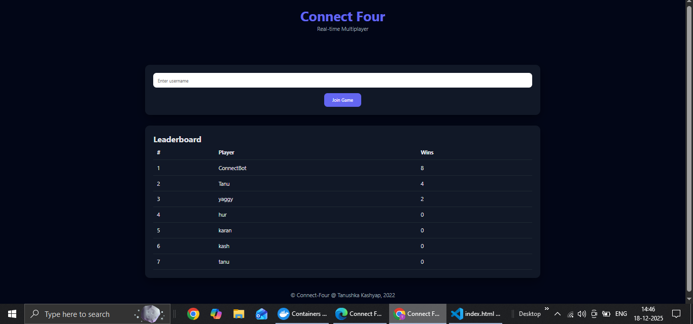
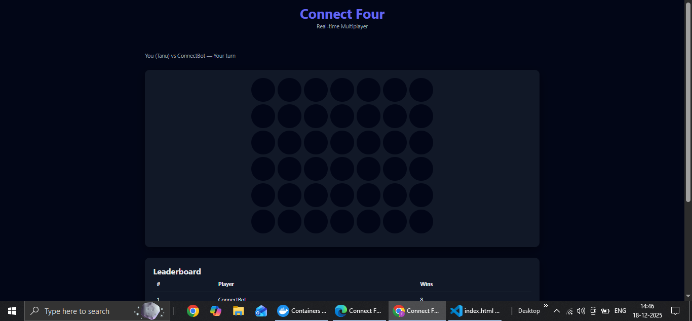
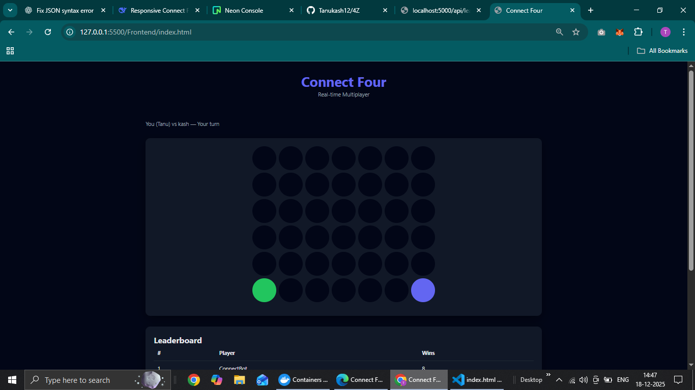

# 🎮 Connect Four (4Z) — Real-Time Multiplayer Game

A full-stack, real-time **Connect Four (4-in-a-Row)** game built with **WebSockets, Node.js, PostgreSQL, Kafka**, and a responsive frontend.  
Supports **Human vs Human**, **Human vs Bot**, **Reconnect handling**, **Leaderboard**, and **Event streaming**.

---

## ✨ Features

- Real-time gameplay using WebSockets
- Human vs Human matchmaking
- Human vs Bot fallback (auto after timeout)
- Reconnect support (30s grace period)
- Persistent leaderboard
- Game persistence (PostgreSQL)
- Kafka event streaming for analytics

---

## 🖼️ Screenshots

### 🏠 Home Page
Join game + leaderboard



---

### 🤖 Human vs Bot



---

### 👥 Human vs Human



---
### 🎥 Demo Video

[Click here to watch the demo video](https://drive.google.com/file/d/1o_-P8TQcGVt_1uQKjQFc9X7_5r61SKtD/view?usp=sharing)


## 🏗️ Tech Stack

### Frontend
- HTML5
- CSS3 
- Vanilla JavaScript 
- WebSocket API

### Backend
- Node.js (ES Modules)
- Express
- WebSocket (`ws`)
- PostgreSQL (Neon)
- Kafka (KafkaJS)
- Docker & Docker Compose

---

## 📁 Project Structure

```text
Connect-Four/
├── backend/
│   └── src/
├── frontend/
├── analytics/
├── screenshots/
├── docker-compose.yml
└── README.md
```

## ⚙️ Environment Variables

Create a `.env` file inside `backend/`:

```env
PORT=5000
DATABASE_URL=postgresql://<user>:<password>@<host>/<db>?sslmode=require
KAFKA_BROKER=localhost:9092
```

# Running the project
1. Start all services
   - docker compose up -d --build
This starts:
-Backend server
-PostgreSQL
-Kafka & Zookeeper
- analytics consumer.js internal

2. Start backend
   - index.html -> Live server
- Frontend runs on : http://127.0.0.1:5500/frontend/index.html

## How to play
### Human vs Human
- Open the site in two browsers
- Enter different usernames
- First player waits, second joins → game starts
- Take turns clicking columns
- If one of the player leaves the game in between opponent will wait within timout(30sec) and if player do not rejoin then the opponent will win and player will get forfeited. 
### Human vs Bot
- Join game alone
- If no opponent joins within timeout(10 sec) → Bot joins automatically

### 🏆 Leaderboard API
- At : http://localhost:5000/api/leaderboard
- Response :
 ```
  {
  "success": true,
  "data":
  [
    { "username": "Alice", "wins": 5 },
    { "username": "Bob", "wins": 3 }
  ]
}
```

### Author 
[@Tanukash12](https://github.com/Tanukash12)
